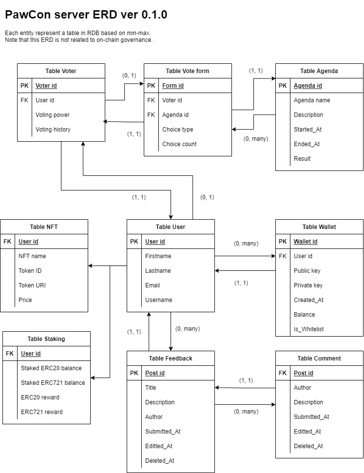

## Content

1. [Heads-up](#heads-up)

1. [Migration](#migration)
1. [Getting started](#getting-started)

   1. [ERD](#erd)
   1. [Formatting](#formatting)
   1. [API](#api)
   1. [Running test](#running-test)

1. [Features](#features)
   1. [Auth](#auth)

## Heads-up

**I'm working on this project only after work. Progress might be updated slowly.**

In version 0.2, PawCon targets to implement a server application with Node.js/Express, serving API and login authentication(JWT, Google Oauth, and Mongo DB). Check [here](https://github.com/developerasun/pawcon/tree/main/server#pawcon-server) to find out what were implemented.

What I'm focusing on server application is to mix decentralization and centralization. Supporting an aunthentication in a traditional way is important since _most of users still logins that way_. On top of that, DID is also important in terms of blockchain development.

## Migration

As project gets bigger and complicated, documentation and readmes were starting to be scattered. To avoid this, all docs will be maintained in a static website using HUGO.

## Getting started

### ERD

Check PawCon server ER diagram. Note that this is a prototype and can be changed over time.



### Dependencies

PawCon server is being built by Go Fiber. Install dependencies in server directory.

```sh
go install
```

Run fiber server with hot reload. This will reboot server whenever code changes.

```sh
fiber dev
```

### Formatting

Run golines to for auto code formatting. Use -w flag to overwrite code.

Format an individual file.

```sh
golines -w ./server.go
```

Format all files.

```sh
golines -w ./
```

### API

API documentation using Swagger will be uploaded later.

### Running test

PawCon server application uses Ginkgo and Gomega.

```sh
go install github.com/onsi/ginkgo/v2/ginkgo
go get github.com/onsi/gomega
```

Generate test suite.

```sh
ginkgo bootstrap
```

Run test.

```sh
ginkgo --succinct
```

## Features

These will be added: apis, sign in with Ethereum, continuous delivery, CORS, cache, web socket

### Auth

PawCon ver 0.3.0 targets to provide three ways for user authentication: 1) json web token 2) Google OAuth 3) Sign in with Ethereum. Note that the last one is _somewhat experimental_. Details is on the way.
